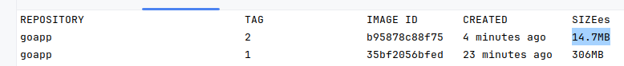

# Simple demo go webserver with docker multi-stage build to minimize image size


## Steps to try
1. Clone the repo
2. Build image with image name goapp and tag 2 with Dockerfile.multi file - ```docker build -t goapp:2 -f Dockerfile.multi .```
3. List docker images - ```docker images```
4. Run the docker image goapp:2 - ```docker run -p 4000:3000 goapp:2```


## Some more docker commands:
1. List all containers - ```docker ps -a```
2. Remove Container - ```docker rm CONTAINER ID```
3. Remove Image - ```docker rmi IMAGE ID```

## Screenshots:
